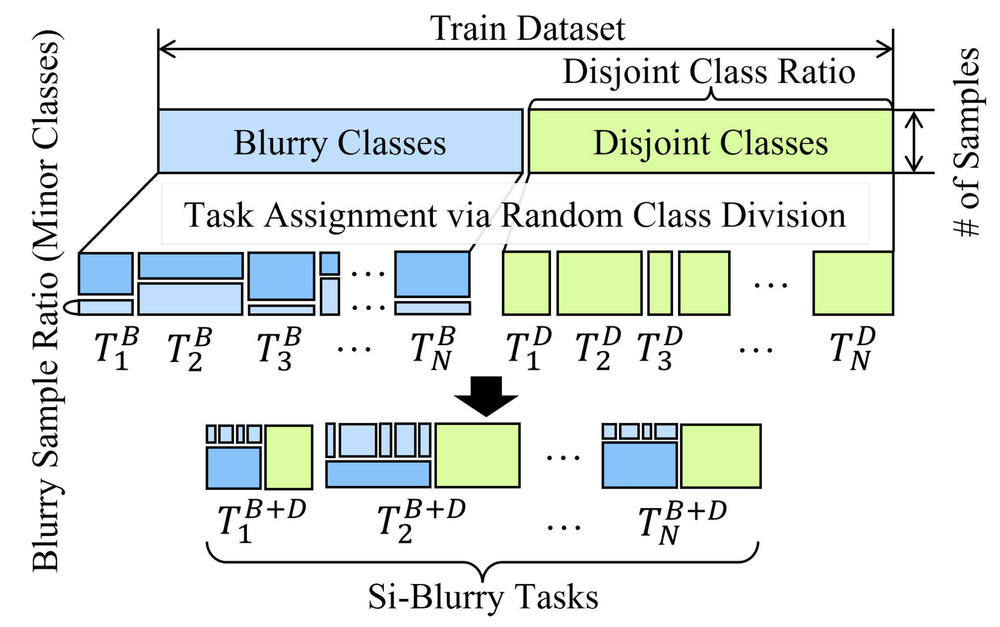
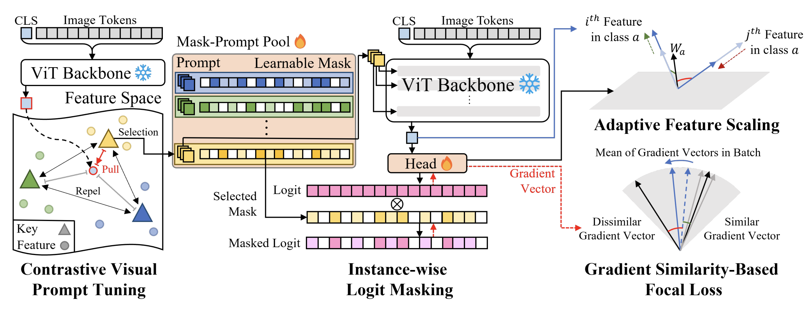

# [ICCV 2023] Official repository for **Online Class Incremental Learning on Stochastic Blurry Task Boundary via Mask and Visual Prompt Tuning**
[](https://arxiv.org/abs/2308.09303)

Official PyTorch implementation for ICCV 2023 paper:

Online Class Incremental Learning on Stochastic Blurry Task Boundary via Mask and Visual Prompt Tuning

Jun-Yeong Moon* Keon-Hee Park* Jung Uk Kim† Gyeong-Moon Park†

## Abstract
 Continual learning aims to learn a model from a continuous stream of data, but it mainly assumes a fixed number of data and tasks with clear task boundaries. However, in realworld scenarios, the number of input data and tasks is constantly changing in a statistical way, not a static way. Although recently introduced incremental learning scenarios having blurry task boundaries somewhat address the above issues, they still do not fully reflect the statistical properties of real-world situations because of the fixed ratio of disjoint and blurry samples. In this paper, we propose a new Stochastic incremental Blurry task boundary scenario, called Si-Blurry, which reflects the stochastic properties of the real-world. We find that there are two major challenges in the Si-Blurry scenario: (1) intra- and inter-task forgettings and (2) class imbalance problem. To alleviate them, we introduce Mask and Visual Prompt tuning (MVP). In MVP, to address the intra- and inter-task forgetting issues, we propose a novel instance-wise logit masking and contrastive visual prompt tuning loss. Both of them help our model discern the classes to be learned in the current batch. It results in consolidating the previous knowledge. In addition, to alleviate the class imbalance problem, we introduce a new gradient similarity-based focal loss and adaptive feature scaling to ease overfitting to the major classes and underfitting to the minor classes. Extensive experiments show that our proposed MVP significantly outperforms the existing state-of-the-art methods in our challenging Si-Blurry scenario

## Introduction
Official repository for online class incremental learning on stochastic blurry task boundary via mask and visual prompt tuning. Code is based on [i-Blurry](https://github.com/naver-ai/i-Blurry). The sampler for Si-Blurry scenario and our proposed MVP are implemented in this repository.
 ## Requirements
   - Pytorch
   - timm

or you can install a conda environment with :
```Bash
   conda env create -f environment.yml
```
## Run
```Bash
   . scripts/mvp.sh
```

## Si-Blurry
<center></center>

it is possible to adjust the disjoint class ratio with N, the blurry class ratio with M in scripts. 
```Bash
   N=50
   M=10
```
The online sampler assumes only the samples in each class are the same number. (Like CIFAR100, TinyImageNet...)
## MVP
<center></center>

## Citation
If you find this code useful for your research, please cite our paper:
```
@inproceedings{moon2023online,
  title={Online Class Incremental Learning on Stochastic Blurry Task Boundary via Mask and Visual Prompt Tuning},
  author={Moon, Jun-Yeong and Park, Keon-Hee and Kim, Jung Uk and Park, Gyeong-Moon},
  booktitle={Proceedings of the IEEE/CVF International Conference on Computer Vision},
  year={2023}
}
```
